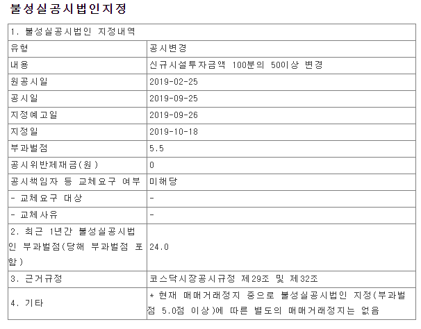

***2021.02***

---
Chapter 1. 상장폐지
---
[전자공시](http://dart.fss.or.kr/)
[한국거래소](https://kind.krx.co.kr/main.do?method=loadInitPage&scrnmode=1)

### 1. 관리종목
1. 상장법인이 갖추어야 할 최소한도의 유동성을 갖추지 못하였거나,
2. 영업실적 악화 등의 사유로 부실이 심화된 종목으로 상장폐지기준에 해당할 우려가 있는 종목

#### 1.1 관리종목 기준
##### 1.1.1 사업보고서 등 미제출
1. 사업보고서를 법정제출기한(결산기후 90일) 내 미제출
2. 반기·분기보고서를 법정제출기한(결산기후 45일)내 미제출

##### 1.1.2 감사의견·반기 검토 의견
1. 감사의견이 감사범위제한으로 인한 한정
2. 반기 검토 의견이 부적정 또는 의견거절

##### 1.1.3 자본잠식
1. **사업보고서** 상 자본금의 50% 이상이 잠식

###### 정의
> 적자로 인해 자본 총계가 자본금보다 적어지는 상황
> 자본 총계 : 빚(부채)를 제외한 시장 가치 (자산총계 - 부채총계)
> 자본잠식률 : (자본금-자본총계)/자본금
> | 기준      | 정상  | 잠식  | 완전잠식 |
> |-----------| ------| ----- | ------- |
> | 자본금     | 1,000 | 1,000 | 1,000   |
> | 자산총계   | 2,000 | 2,000 | 2,000   |
> | 부채총계   | 500   | 1,500 | 2,000   |
> | 자본총계   | 1,500 | 500   | 0       |
> | 자본잠식률 | X     | 50%   | 100%    |

##### 1.1.4 주식분포 미달(사업/반기/분기 보고서)
1. 소액주주수 200명 미만
2. 소액주주 지분율 10% 미만

##### 1.1.5 거래량 미달
1. 반기 월평균거래량이 유동주식수의 1% 미만

##### 1.1.6 지배구조 미달
1. 증권거래법상 사외이사수 및 감사위원회 구성요건을 미충족
  - 사외이사수가 이사 총수의 1/4미만 등(자산총액 2조원 이상 법인의 경우 사외이사 3인 이상, 이사 총수의 과반수 미충족)
  - 감사위원회 미설치 또는 사외 이사수가 감사 위원의 2/3 미만등(자산총액 2조원 이상 법인만)

##### 1.1.7 공시의무 위반
1. 공시의무위반 누계벌점 15점 이상

##### 1.1.8 매출액 미달
1. 최근사업연도 50억 원 미만
  - **코스피** 50억원
  - **코스닥** 30억원. 단 ***기술성장기업, 이익미실현기업*** 은 각각 상장 후 5년간 미적용

##### 1.1.9 주가수준 미달
1. 액면가의 20% 미만 상태가 30매매일간 계속

##### 1.1.10 시가총액미달
1. 시가총액 50억 원 미만 상태가 30매매일간 계속
